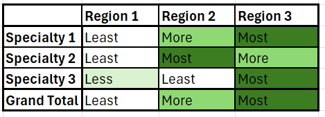
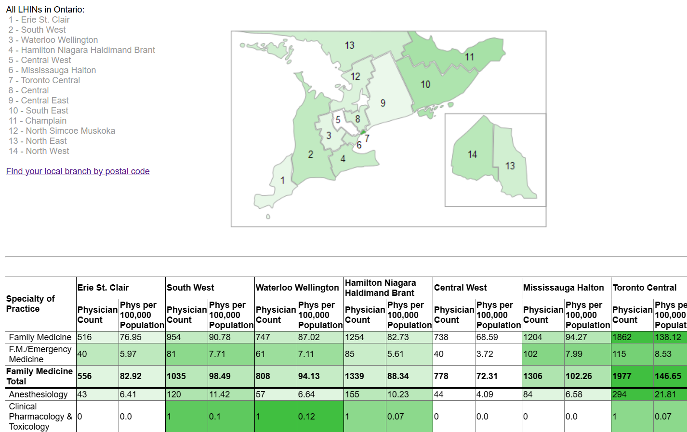
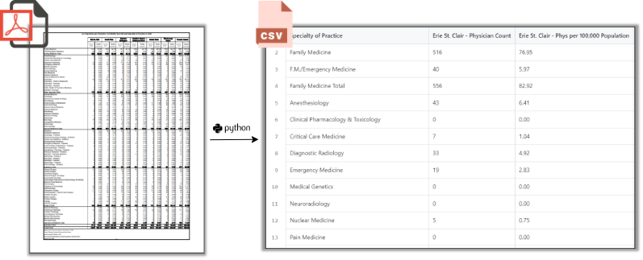
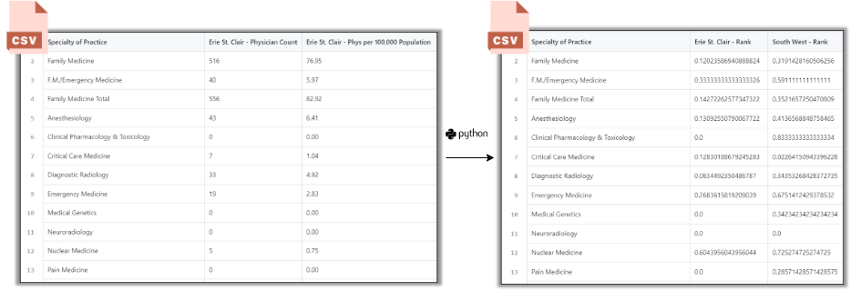
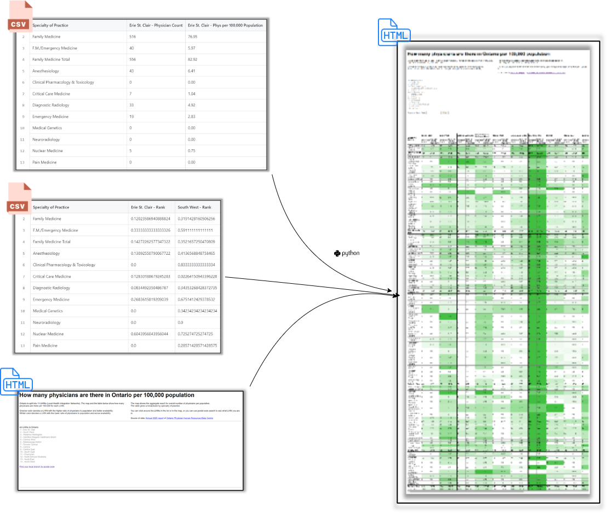
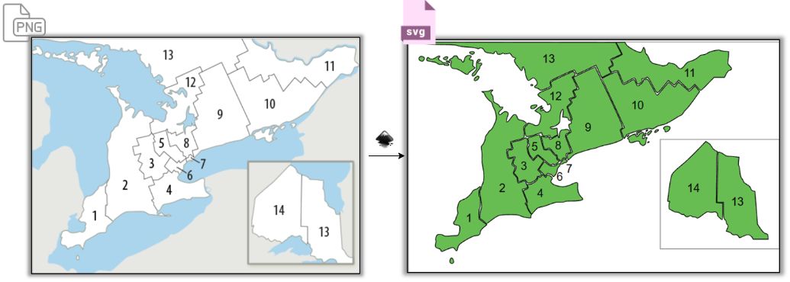
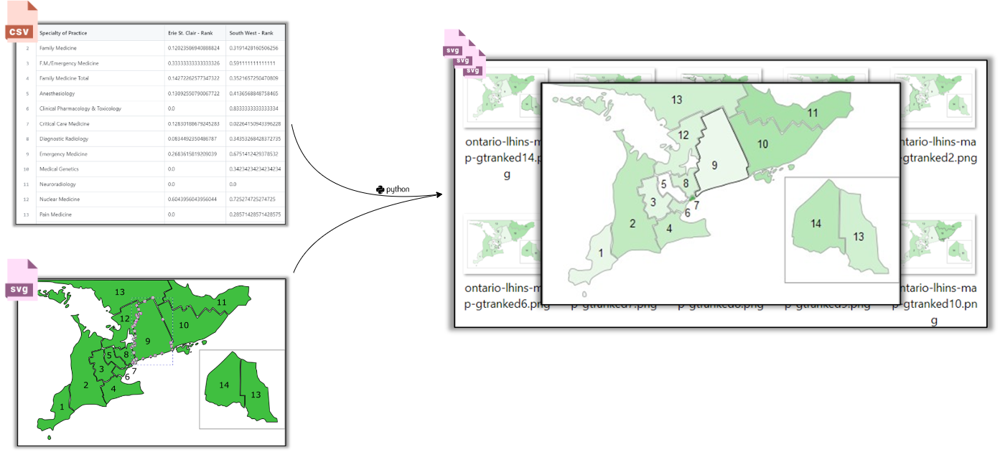
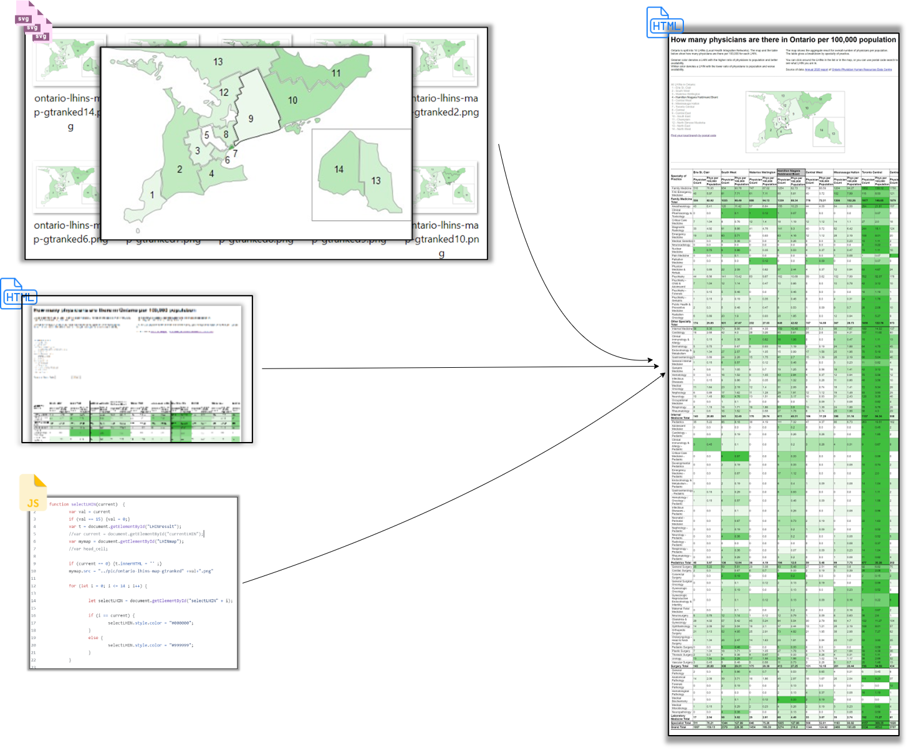

# Availability of physicians in Ontario
## Overview
When we discuss availability of health care in Ontario, we sometimes wonder: is it more available in big cities?  

There are more health care professionals in big cities, so maybe the access is easier.  
But the population is bigger too, so maybe the access is harder?    

Both suggestions sound plausible, so let's look at the data.  
We need to compare a ratio between the number of health care professionals and the population broken down by regions, like this:  

### Sourcing the data 
I use the 2020 annual report from Ontario Physician Human Resources Data Centre.  
It has a table "Population per Physician in ONTARIO by LHIN and Specialty of Practice in 2020", which has a relevant pre-calculated attribute "Phys per 100,000 Population".  
Note that the title of the table and the name of the attribute have inverse meanings.  
I rely on the wording of the attribute name, which means that the larger the value, the better is the availability (more doctors per patients).   

LHINs are a way to divide Ontario into regions in the context of healthcare. This term was current in 2020, but it will be superceded by Ontario Health Regions.   
To have a way to see LHINs on a map, I vectorized a map of LHINs, assigned LHINs identifiers to corresponding shapes, and saved it as an SVG. 

### Data Preparation  
I extract the needed table from the report and make a dataset out of it, where rows are for Specialties of Practice, and columns are for LHINs.
For every Specialty of Practice I calculate a relative ranking from 0 to 1, where 0 would be assigned to a LHIN with the least ratio and 1 to the largest ratio.  
This ranking is also calculated for the row Grand Total, which represents availability for all specialties altogether. Based on this ranking I calculate the colors for LHINs on the map. 

### Visualization  
The dataset is visualized as an HTML table where:  
- LHINs with the best availability within a Specialty are marked with dark green
- LHINs with the worst availability within a Specialty are marked with white
- LHINs in between are marked with green of varying lightness according to their ranking

The LHINs are shown on a map of Ontario and their areas are filled by their ranking in the Grand Total. The darker the area, the better is the availability.  

The HTML page lets the user to choose a LHIN from a list, which automatically highlights the LHINs on the map and in the table. If the column for the selected LHINs is not visible, the page is automatically scrolled to bring that column into view. 

A user can also click on the tile of LHIN column which highlights this LHIN on the map.  

The result clearly shows which geographical area has more or less physicians per 100 000 population.  
The result is hosted at https://olga-terekhova.github.io/html/physicians.html and looks like this:  

### Installation
#### Prepare source files:
The dataset PDF is in [2020-PIO-Annual-Report.pdf](data/2020-PIO-Annual-Report.pdf).
The template for the HTML page is in [physicians_src.html](html/physicians_src.html). It is the source of all HTML elements excluding the cells of the dataset. 
The JavaScript for the HTML page is in [LHINSelect.js](js/LHINSelect.js). 
The map of LHINs is in [ontario-lhins-map-final.svg](pic/ontario-lhins-map-final.svg).  
The Python code with main functionality is in [main.py](py-code/main.py).  

#### Run:  
Run the [main.py](py-code/main.py).  
The outputs:
- the resulted HTML page [physicians.html](html/physicians.html), which now has cells populated with data
- PNG files for the map in the [pic](pic/) folder, where shapes for LHINs are colored according to ranking and highlighted according to the selected LHIN

#### Share:  
Publish the following files preserving folder hierarchy:
- html/physicians.html
- js/*
- pic/*

The resulted HTML page [physicians.html](html/physicians.html) should not be edited directly. It is generated using the script [main.py](py-code/main.py).  
The script [main.py](py-code/main.py) also colors the areas of LHINs on a map in the file  and outputs PNG files in the [pic](pic/) folder.

#### Retired functionality:  
Previous versions of the page included an option to get a LHIN by a postal code. After Ontario Health redesigned this API, it's no longer functional.  

 
## Detailed flow chart of the project

## Description of the flows
### 1 - Grabbing the data and saving it into CSV

  

Source: 
1. https://www.ophrdc.org/wp-content/uploads/2021/11/2020-PIO-Annual-Report.pdf copied to https://github.com/olga-terekhova/physicians-availability/blob/main/data/2020-PIO-Annual-Report.pdf

Python code:  
1. The function extract_table:
   - Takes the source pdf
   - Parses two pages with the needed table ("Population per Physician in ONTARIO by LHIN and Specialty of Practice in 2020" on pages 45-46)  
   - Splits it by dividers
   - Loads it into pandas dataframe
   - Assigns labels
   - Loads the data into a csv file.
  
Dependencies:  
1. tabula-py and java runtime used by tabula-py under the hood to parse a PDF into a table. 
2. pandas.

Outcome:
1. CSV file with values (https://github.com/olga-terekhova/physicians-availability/blob/main/data/df_values_2020.csv)

### 2 - Calculating ranking of LHINs for every specialty of practice

  

Source:
1. CSV file with the source data (https://github.com/olga-terekhova/physicians-availability/blob/main/data/df_values_2020.csv)

Python code:  
1. The function assign_rank:
   - Calculates a mininum and a maximum value for the "Physicians per 100 000 population" measure within each row.
   - Assigns a rank for each LHIN within this row calculated according to the formula: (current LHIN value - min value) / (max value - min value), so that the rank ranges from 0 to 1.
   - Saves the result for the current row into cells labeled as "Name of the LHIN" + " - Rank". 
   - Writes the resulting dataset into a CSV.

Dependencies: 
1. pandas.

Outcome:
1. CSV file with ranking (https://github.com/olga-terekhova/physicians-availability/blob/main/data/df_rank_2020.csv)

### 3 - Generating an HTML file with the table containing the data and colored according to the ranking

  

Source:
1. The initial HTML file (https://github.com/olga-terekhova/physicians-availability/blob/main/html/physicians_src.html) contains the whole content of the target HTML file except for the table with data. Instead of this a placeholder "&lt;table&gt;&lt;/table&gt;" is used.
2. CSV file with values (https://github.com/olga-terekhova/physicians-availability/blob/main/data/df_values_2020.csv)
3. CSV file with ranking (https://github.com/olga-terekhova/physicians-availability/blob/main/data/df_rank_2020.csv)

Python code:  
1. The function generate_html_table:
   - Generates the whole TABLE element containing values from the CSV file with values. 
   - Adds a JavaScript function call to the headings with the names of LHINs and passes the code of the LHIN as a parameter. It will allow the user to select a current LHIN by clicking on the headings. 
   - Adds element names "LHINleft" and "LHINright" to the cells. It will allow to highlight properly the left and and the right column for a LHIN when the user selects a LHIN.
   - Calculates an HSL background color for each cell according to the rank of the LHIN within each row. H component is 120 (green), S component is 50%, L component is calculated according to the formula: (1-(Rank/2)) * 100, so that the highest ranked LHIN has 50% lightness (green) and the lowest ranked LHIN has 100% lightness (white).
   - Replaces the "&lt;table&gt;&lt;/table&gt;" in the source file with the generated TABLE element.

Outcome:
1. Resulting HTML file (https://github.com/olga-terekhova/physicians-availability/blob/main/html/physicians.html)

### 4 - Creating an SVG map of LHINs

  

Source:
1. PNG file with a map of LHINs (https://github.com/olga-terekhova/physicians-availability/blob/main/pic/ontario-lhins-map.png).

Inkscape transformations:  
1. I used vectorisation functionality to convert the map into SVG and cleaned it up so that each shape was assigned an ID with a LHIN code. 

Outcome:
1. SVG map (https://github.com/olga-terekhova/physicians-availability/blob/main/pic/ontario-lhins-map-final.svg)

### 5 - Generating several SVG maps: colored according to the ranking and highlighting current LHIN

  

Source: 
1. SVG map (https://github.com/olga-terekhova/physicians-availability/blob/main/pic/ontario-lhins-map-final.svg)
2. CSV file with ranking (https://github.com/olga-terekhova/physicians-availability/blob/main/data/df_rank_2020.csv)

Python code:  
1. The function generate_png_for_all_current:
   - Iterates through 0 to 14 LHIN codes.
   - For each LHIN code parses the SVG file into a tree using ElementTree library.
   - Collects and iterates through LHIN shapes within the tree.
   - If the code of the LHIN is equal to the code of the current code, then the shape's outline is highlighted with black.
   - The fill color for the shape is generated according to the rank of the corresponding LHIN (based on Grand Total row).
   - The SVG code from the tree is written into a PNG file. 

Outcome:
1. 15 png files: one for a map with no LHIN selected (https://github.com/olga-terekhova/physicians-availability/blob/main/pic/ontario-lhins-map-gtranked0.png) and 14 files for each LHIN selected as a current one.

### 6 - Showing the end result as a dynamic HTML page

  

Source:
1. HTML file (https://github.com/olga-terekhova/physicians-availability/blob/main/html/physicians.html)
2. 15 png files with LHIN maps

Outcome:
1. A dynamic HTML page (https://olga-terekhova.github.io/html/physicians.html) with following functionality:
   - a user can select a current LHIN by clicking on it in the list or clicking on the table heading
   - when a user selects a current LHIN, it gets highlighted on the map and in the table. The LHIN columns are automatically scrolled into view. 
